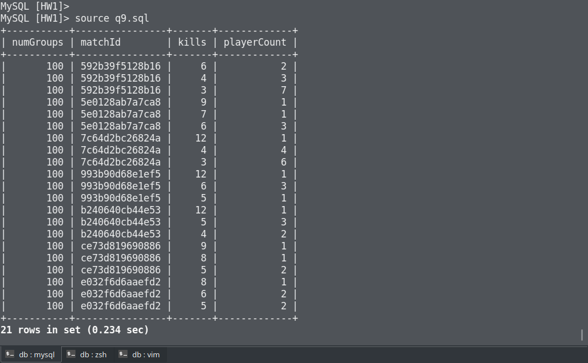

## 在最多小組參加(numGroups)的比賽中找出前三高的擊殺數(kills)，並列出有多少玩家獲得該擊殺數

```sql
SELECT numGroups, match.matchId, kills, COUNT(*) as playerCount
FROM player_statistic as ps
INNER JOIN `match`
ON match.matchId = ps.matchId
WHERE 
    numGroups = (
        SELECT MAX(numGroups) FROM `match`
    ) AND (
        SELECT COUNT( DISTINCT ps2.kills)
        FROM player_statistic as ps2
        WHERE ps2.kills > ps.kills AND ps.matchId = ps2.matchId
    ) < 3
GROUP BY matchId, kills
ORDER BY matchId, kills DESC;
```

